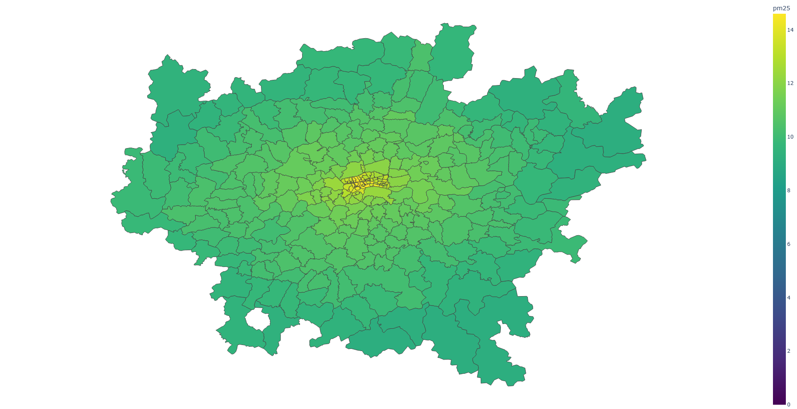

# AirQualityDisease

This program explores the relationship between AirQuality and Disease in London area.
- ```data```: include the data of air quality, postcode genjson, London shapefile and patient.
- ```lib```: the script of preprocess data.
- ```misc```: tranfer air quality csv file to raster.
- ```plot```: the script of plotting air quality distribution and disease distribution in London.


## 1. Map air quality and Postcode

[map_postscode.py](./map_postscode.py) generates average air pollution concentration for each postcode in London.

- [postcode_no2.xlsx](./data/postcode_no2.xlsx): Average no2 for each postcode in London
- [postcode_pm25.xlsx](./data/postcode_pm25.xlsx): Average pm25 for each postcode in London


[plot_postcode_aq.py](./plot/plot_postcode_aq.py) Plot the air quality map in London area.

Visualization:

|                        pm2.5 distribution                        |                       no2  distribution                    |
| :----------------------------------------------------------: | :----------------------------------------------------------: |
|  |  |


## 2. Map Disease and Postcode

[map_disease.py](./map_disease.py) Counting the patient number of disease for each postcode in London.

- [postcode_disease.xlsx](./data/postcode_disease.xlsx): The patient number of disease for each postcode in London.

Visualization:

|                      **ABPA**                      |
| :----------------------------------------------------------: |
|  |
|                     **Asthma**                  |
|  |
|                     **COVID**                  |
|  |
|                     **Cystic Fibrosis**                  |
|  |


## 3. Calculate the Pearson correlation coefficient of air quality and disease.

[aq_disease_corr.py](./aq_disease_corr.py) the Pearson correlation coefficient of air quality and disease.


|      | Cystic Fibrosis | COVID  |  ABPA  | Asthma |
| :--: | :-------------: | :----: | :----: | :----: |
| NO2  |     -0.029      | -0.076 | -0.125 | -0.07  |
| PM25 |     -0.076      | -0.108 | -0.163 | -0.119 |


For area where have more patients data(>3 patients) and the correlation：

|      | Cystic Fibrosis | COVID |  ABPA  | Asthma |
| :--: | :-------------: | :---: | :----: | :----: |
| NO2  |      0.077      | 0.178 | -0.032 | 0.158  |
| PM25 |      0.130      | 0.046 | -0.018 | 0.143  |
